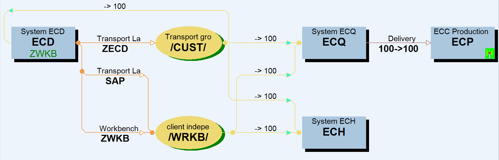

## TMS Settings

| ECD,ECQ,ECP  | DOMAIN_S4D                     | DIR_TRANS | \sapvhtphost\SAPTRANS\EC\trans |
| ------------ | ------------------------------ | --------- | ------------------------------ |
| DIR_EPS_ROOT | \sapvhtphost\SAPTRANS\EC\trans |           |                                |
| TRANSDIR     | \sapvhtphost\SAPTRANS\EC\trans |           |                                |
|              |                                |           |                                |
| S4D          | DOMAIN_S4D                     | DIR_TRANS | \sapvhtphost\SAPTRANS\EC\trans |
| DIR_EPS_ROOT | \sapvhtphost\SAPTRANS\EC\trans |           |                                |
| TRANSDIR     | \sapvhtphost\SAPTRANS\EC\trans |           |                                |

